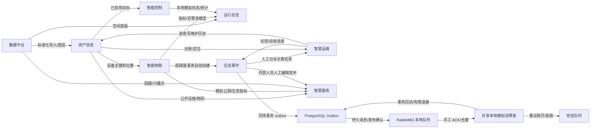
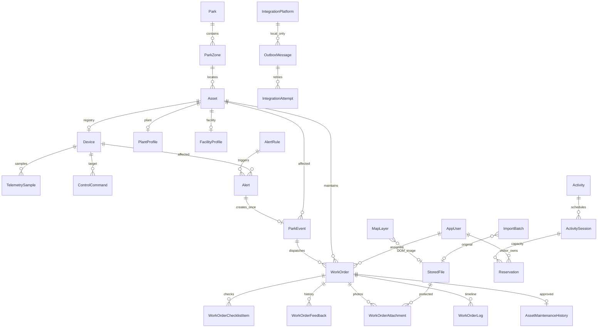
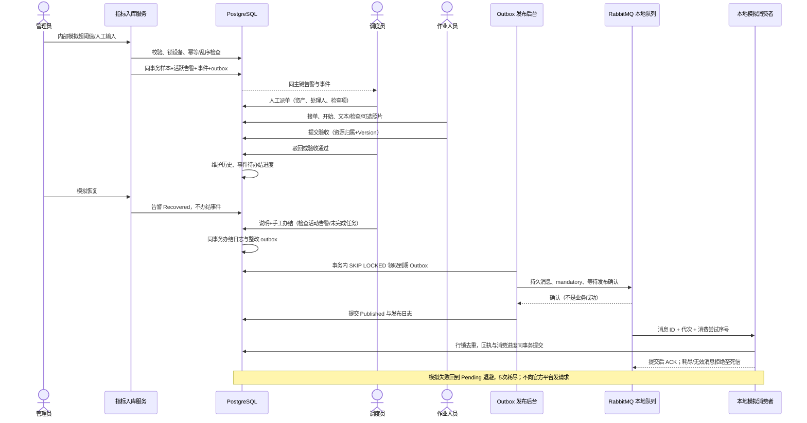

# 模块设计与关联说明

## 拆分依据与边界

依据 `核心功能模块.md:7-14` 的八个业务模块组织页面与 Controller，不拆八个微服务。单公园、单 API 副本、同源 Nginx；PostgreSQL 为事实来源，Redis 只缓存总览。现有主需求不改写；用户确认取消移动端，以桌面“我的任务”替代原文移动接单/拍照流程。

| 模块 | 主要页面 | API 前缀 | 拥有的数据与职责 | 消费的上游 / 产生的下游 |
|---|---|---|---|---|
| 数据平台 | `/admin/platform` | `/api/platform` | Park/Zone、MapLayer、ImportBatch、StoredFile；底板与导入治理 | 标准文件 → 资产/地图/导览；不复制资产业务台账 |
| 智慧服务 | `/admin/services`、`/visitor` | `/api/services`、`/api/public` | Tag、Announcement、Activity/Session、Reservation；审核公开内容、预约与导览 | 公开资产/园路/指标 → 游客；不暴露内部事件/人员/工单 |
| 运行总览 | `/admin/overview`、`/screen` | `/api/overview` | 查询聚合读模型、短缓存、生态演示分 | 遥测/事件/任务/资产 → KPI/趋势/地图；不修改业务状态 |
| 智能控制 | `/admin/control` | `/api/control` | ControlCommand、设备本地模拟状态/序号 | 已启用设备 → 模拟指令/回执；不将回执当实测遥测 |
| 智能物联 | `/admin/iot` | `/api/iot` | MetricDefinition、TelemetrySample、Alert/Rule/Log、虫情、模拟进出 | Device 主键 → 历史/指标/告警/自动事件；无设备接入入口 |
| 智慧运维 | `/admin/operations`、`/admin/operations/my-tasks` | `/api/operations` | WorkOrder、Checklist/Feedback/Attachment/Log、FloodPlan | 事件/资产 → 桌面作业、验收、维护历史/整改反馈 |
| 资产信息 | `/admin/assets` | `/api/assets` | Asset、Device、Plant/FacilityProfile、公开码、维护历史 | 区域/标准导入 → 各模块共同资产标识；退役不抹历史 |
| 应急与外部协同 | `/admin/emergency`、`/admin/integrations` | `/api/emergency`、`/api/integrations` | ParkEvent/EventLog、IntegrationPlatform、OutboxMessage/Attempt | 自动/人工事件 → 派单、办结、共享本地模拟五平台回执 |

源码业务入口为 `backend/SmartPark.Api/Features/<模块>/*Controller.cs`；实体与关系由 `Data/Entities.cs` 和 `Data/ParkDbContext.cs` 集中定义，迁移位于 `Data/Migrations/`。前端按业务拆分 `src/views/*View.vue`，通用地图、趋势和来源提示位于 `src/components/`。不是动态万能表格或前端硬编码业务数组。

`/api/public` 是跨模块共享的公开前缀：`park`、`map`、`route` 由数据平台 `PublicMapController` 提供；`assets/{publicCode}` 由资产模块提供；标签、公告、活动、预约、生态、公厕由 `PublicServicesController` 提供。前端导览属于智慧服务体验，不表示路网实体移交服务模块。

## 原文子服务映射矩阵

实现级别：**业务**＝真实数据库/API 业务；**模拟**＝模拟输入或回执、业务仍落库；**说明**＝只交付具体生产要求，未实现真实能力；**取消**＝用户明确排除。本表不把说明计作实际接入。

| 原文子服务 | 归属 / 页面（页内标签） | 后端服务 / 主要实体 | 上游输入 → 下游输出 | 级别 | 验收动作 |
|---|---|---|---|---|---|
| 公园 DLG 数据采集 | 数据平台 /platform 导入 | DataPlatformController / MapLayer、ImportBatch | WGS84 GeoJSON → 本地矢量/园路 | 业务导入；测绘说明 | 预览错误，再确认地图图层 |
| 公园 DOM 数据采集 | 数据平台 /platform 导入 | LocalFileStore / MapLayer、StoredFile | 已配准 PNG/JPEG+范围 → imageOverlay | 业务导入；配准说明 | 上传样例与范围，重启后仍可显示 |
| 公园元素入库 | 数据平台 /platform CSV | CsvHelper / Asset、ImportBatch | CSV 规范行 → 统一资产 | 业务 | 有效文件确认；重复编码拒绝 |
| 公园视频数据接入 | 数据平台 /platform 视频说明；资产 /admin/assets Camera 台账 | AssetsController / Asset、Device（Camera） | 示例元数据 → 共享视频资源台账 | 台账业务；视频说明 | 在资产页登记摄像头，物联页查看无真实视频提示 |
| 公园标签信息管理 | 智慧服务 /services 标签 | ServicesController / Tag | 管理员标签 → 公开服务 | 业务 | 新建标签与公开查询 |
| 公告管理 | 智慧服务 /services 公告 | Announcement | 人工草稿/事件引用 → 已审核公开内容 | 业务 | 发布/撤回，游客仅看有效公告 |
| 活动预约管理 | 智慧服务 /services、/visitor | ReservationService / Activity、Session、Reservation | 游客/容量 → 随机预约码/核销 | 业务 | 并发不超额，取消释放、核销不可取消 |
| 智慧导览 | 智慧服务 /visitor 导览 | PublicMapController / RoadGraph | 已录入园路和位置 → 最短路/距离 | 业务简化 | 连接节点返回路线，断路明确不可用 |
| 生态指数 | 智慧服务 /visitor、总览 | EcoIndexService | 有效 PM2.5/噪声/DO → 公式分项 | 演示估算 | 公式可见，过期/缺失显示数据不足 |
| 智慧公厕服务 | 智慧服务 /visitor 公厕 | PublicServicesController / 公厕资产+遥测 | 公开设施/模拟指标 → 时间/占用状态 | 业务+模拟 | 位置可查，过期占用不当实时 |
| 游客量监测 | 总览 /overview、/screen | VisitorCounterSample / OverviewQueryService | 模拟进出 → 当日/在园/趋势 | 模拟 | 幂等、不能负数、显示来源 |
| 土壤墒情总览 | 总览 /overview | TelemetrySample / MetricLatest | soilMoisture → 单位/时间/趋势 | 模拟输入 | 卡片显示 % 与采集时间 |
| 水位参数总览 | 总览 /overview | TelemetrySample | waterLevel → 水位趋势 | 模拟输入 | 显示 m、暂停/过期状态 |
| 噪声指标总览 | 总览 /overview | TelemetrySample | noise → dB 趋势 | 模拟输入 | 时间范围和来源正确 |
| 水质监测总览 | 总览 /overview | TelemetrySample | ph/DO/浊度 → 卡片与趋势 | 模拟输入 | 三指标单位不同且来源可见 |
| 环境监测总览 | 总览 /overview | TelemetrySample | 气象/PM2.5 → 聚合指标 | 模拟输入 | 温湿度/风雨/空气指标可查询 |
| 公园一张图 | 总览 /overview、/screen | PublicMapController / 共享资产位置 | 边界/道路/资产 → 图层关联地图 | 业务简化 | 本地显示，图层开关与关联详情 |
| 智能灌溉控制 | 控制 /control | ControlController / CommandHostedService | 设备、时长 → 持久化模拟指令 | 模拟 | 启停/到期/失败/超时，不冒充硬件动作 |
| 视频管理 | 物联 /iot 视频 | Device（Camera） | 示例资源 → 列表位置/生产要求 | 台账业务；说明 | 无视频播放器或假画面 |
| 数字广播 | 物联入口、/control | ControlCommand、MediaMaterial | 文本/本地音频 → 本地模拟发送/停止 | 模拟 | 显式预听与模拟回执日志 |
| 智慧路灯 | 物联入口、/control | ControlCommand、Device | 开关/亮度 → 本地状态/回执 | 模拟 | 亮度范围校验，失败不显示成功 |
| 土壤墒情监测 | 物联 /iot 监测 | TelemetryIngestService / Soil 设备 | Seed/Manual/Simulation → 指标/阈值 | 业务+模拟 | 手工异常产生关联告警/事件 |
| 水位监测 | 物联 /iot 监测 | TelemetrySample / WaterLevel | m 读数 → 历史/告警 | 业务+模拟 | 单位不匹配拒绝 |
| 水质监测 | 物联 /iot 监测 | TelemetrySample / WaterQuality | pH、mg/L、NTU → 历史/告警 | 业务+模拟 | 分指标查询，不混用单位 |
| 公厕数据采集 | 物联 /iot 监测 | Toilet 设备/occupancy | 内部模拟 → 公共裁剪状态 | 模拟 | 停模拟后变过期/未知 |
| 噪声监测 | 物联 /iot 监测 | Noise 设备/noise | 演示 dB → 趋势/告警 | 业务+模拟 | 超阈值和恢复不是事件办结 |
| 气象环境 | 物联 /iot 监测 | Weather / 指标定义 | 温湿度/风速/雨量/PM2.5 → 总览 | 业务+模拟 | 设备指标匹配，来源可追溯 |
| 虫情测报 | 物联 /iot 虫情与监测 | PestObservation、pestCount | 人工虫情 → 记录；Pest 设备虫数遥测 → 趋势/阈值 | 业务+模拟；AI说明 | 人工记录可查；选择 Pest 设备查看遥测趋势，人工记录不冒充时序遥测 |
| 日常保养 | 运维 /operations | WorkOrder（Maintenance） | 资产/保养项目 → 反馈/日期/维护记录 | 业务 | 专属检查项及验收 |
| 设备设施维修 | 运维 /operations | WorkOrder（Repair） | 故障/方案/费用 → 维修反馈 | 业务 | 专属字段；非支付 |
| 防汛防台 | 运维 /operations 防汛 | FloodPlan、WorkOrder（Flood） | 预案/重点区/检查项 → 应急任务 | 业务 | 预案落库，任务流转 |
| 植物养护 | 运维 /operations | WorkOrder（PlantCare）、PlantProfile | 植物/项目 → 养护记录 | 业务 | 关联植物与检查反馈 |
| 保安巡更 | 运维 /operations | WorkOrder（Patrol） | 区域/路线说明 → 异常反馈 | 业务；移动取消 | 桌面检查，无定位签到 |
| 保洁 | 运维 /operations | WorkOrder（Cleaning） | 区域/项目 → 完成说明 | 业务 | 分派、反馈、验收 |
| 物码信息管理 | 资产页 `/admin/assets` 二维码；资产详情公开入口 | Asset.PublicCode；qrcode | 唯一公开码 → 本应用公开链接 | 业务 | 预览/下载 QR，游客看公开裁剪 |
| 巡查 | 运维 /operations | WorkOrder（Inspection） | 区域/检查表 → 问题/整改 | 业务 | 检查项结果与反馈历史 |
| 传感器设备管理 | 资产 /assets 传感器 | Asset、Device 一对一 | 统一台账 → 物联/控制关联 | 业务 | 创建、修改、停用/退役 |
| 基础设施管理 | 资产 /assets 设施 | FacilityProfile | 分类/数量规格 → 位置/任务关联 | 业务 | 列表/详情/历史/地图 |
| 活植物管理 | 资产 /assets 植物 | PlantProfile、CarbonEstimateService | 树种/胸径/树高 → 养护/储量估算 | 业务+估算 | 缺字段不计；非年度碳汇 |
| 事件台账管理 | 应急 /emergency | ParkEvent、EventLog | 告警自动/人工 → 台账/派单 | 业务 | 关联主键及时间线可追溯 |
| 事件办结管理 | 应急事件详情 | EmergencyService | 处置/验收/告警恢复 → 人工办结/outbox | 业务 | 活跃告警/未完成任务阻止办结 |
| 事件统计分析 | 应急 /emergency | Statistics 查询 | 事件时间/类型/级别 → 统计 | 业务 | 统计与台账范围一致 |
| 上海市智慧公园综合管理平台 | 协同 /integrations | IntegrationPlatform、Outbox/Attempt | 概况/客流/事件 → 本地回执 | 模拟+生产说明 | 不称已报送官方平台 |
| 区城运汇治理系统 | 协同 /integrations | 共享本地模拟适配器 | 事件/办结 → 本地回执/重试 | 模拟+生产说明 | 故障注入、有限重试、手动重试 |
| 徐汇区视觉中枢平台 | 协同 /integrations | 共享本地模拟适配器 | Camera 元数据 → 本地回执 | 模拟+生产说明 | 不传视频流 |
| 徐汇区绿化动态管理信息系统 | 协同 /integrations | 共享本地模拟适配器 | 植物/养护/整改 → 本地回执 | 模拟+生产说明 | 记录注明未发送 |
| 随申码运行管理平台 | 协同 /integrations | 共享本地模拟适配器 | 本应用物码 → 本地回执 | 模拟+生产说明 | 无实名/认证/官方码能力 |
| 原文移动端总览/接单/打卡/拍照 | 不建设 | 桌面后台与文件上传替代 | 用户取消移动专项 | 取消 | 不使用手机/GPS视口验收 |

五平台共用一套本地模拟处理逻辑，手工同步选择单个平台和 Assets、VisitorCount、VideoMetadata、PublicCodes 类型，队列记录类型与操作者元数据。事件创建、办结和整改自动 outbox 不指定外部目标，生成“通用事件模拟”回执，不是向五平台 fan-out，也没有发送完整业务档案。平台官方事件/植物/养护字段映射只属于生产要求说明。

表中业务动作以代码和测试为准，验证完成状态另见优化验证报告；覆盖页面不等于所有异常场景已验收。

## 模块关联

箭头包含三种关系：读取共享主键/投影、业务事务自动触发、内部人员人工动作。公告引用事件不等于自动向游客发布事件；游客 API 不返回内部事件描述。控制模拟成功不生成“真实”设备读数。

## 关键实体关联

图中连线同时包含数据库 FK 与业务 UUID 引用，并非全部由数据库外键约束保证。例如告警规则/设备引用、预约游客、outbox 平台以及图层/导入文件引用中，部分关系由服务层校验；实际 FK 以 `ParkDbContext` 和 Migration 为准。

UUID 是关联主键；业务编号/编码/公开码另行唯一。资产与设备不维护两套冲突台账。角色来自 Identity，不是可由注册请求写入的字符串。照片所属任务是服务端权限判断对象，公开码只能访问公开字段。

## 感知—分析—处置—反馈—协同时序

## 权限和状态机

- 管理员维护系统/数据/规则，独占周期模拟器启停和异常/恢复场景；调度员负责事件派单、验收、本地控制指令、手工遥测/客流、协同重试与核销，不管理用户/系统配置。
- 作业人员仅能查看/操作自己的任务和相关资产；重派后旧处理人立即失去操作及附件权限。
- 游客匿名读取公开内容；登录后只能预约/取消自己的记录。前端隐藏菜单不是安全边界，后端同时校验角色、归属和字段。
- 工单：`Assigned → Accepted → InProgress → PendingReview → Completed`；驳回回 InProgress，带原因取消到 Cancelled；验收前重派回 Assigned。提交必须有文字和检查结果，照片可选。
- 事件：`Open → Assigned → Processing → PendingClosure → Closed`。无任务可由授权人员写处置说明申请办结。误报需要原因、取消活动任务并抑制同轮告警至恢复。
- 告警确认 ≠ 告警恢复 ≠ 工单完成 ≠ 事件办结。恢复后再次异常是新一轮，历史不静默合并。
- 指令：Pending → SimulatedSucceeded / Failed / TimedOut；序号防旧回执覆盖新状态，重启本地运行状态归停止/未知。
- 预约 Valid → Cancelled / CheckedIn；开始前才可取消，有效记录唯一、容量扣减与新增同事务。

关键更新使用 Version 并发字段，冲突 409 提示刷新。活跃告警与有效预约使用数据库部分唯一索引，不以 Redis 锁替代事实约束。业务和 outbox 同库事务，不把预约、遥测告警、工单验收等事实写入改成异步。`OutboxHostedService` 只负责发布，`IntegrationConsumerHostedService` 只负责消费；两者按作用域释放数据库服务。消息 ID 复用 Outbox 主键，协议版本为 1，发生时间来自创建时间；载荷只传关联标识/类型/代次/序号，模拟消费者回查同库事实，不代表独立服务完整事件档案。`Pending → Published → Succeeded` 分开表达入库、代理确认、模拟回执；失败退避可返回 Pending，重试耗尽为 Failed。人工重放只允许 Failed，递增 Generation 并重置本代计数，日志唯一键为消息 ID + 代次 + 阶段 + 尝试序号，旧代投递不会覆盖新代结果。连续发布失败与模拟消费失败各限制 5 次，成功发布重置发布失败预算；消费耗尽进入持久死信。至少一次投递依赖数据库去重，不承诺无限可靠、exactly-once、代理卷丢失自动恢复或整个应用多副本支持。

## 技术因果与验证入口

共享资产主键减少重复台账，状态机避免把不同办结意义混同；不以理论推导维护效率百分比。复合索引、短缓存、数据库分页/趋势聚合降低查询或载荷的机制与实测详见 [优化验证报告](优化验证报告.md)。

本地示例影像与音频是合成素材，不是真实航拍/广播；全部来源、时间和生产要求应在相应页面显示。生产条件的逐项说明见 [生产要求与降级说明](生产要求与降级说明.md)。
